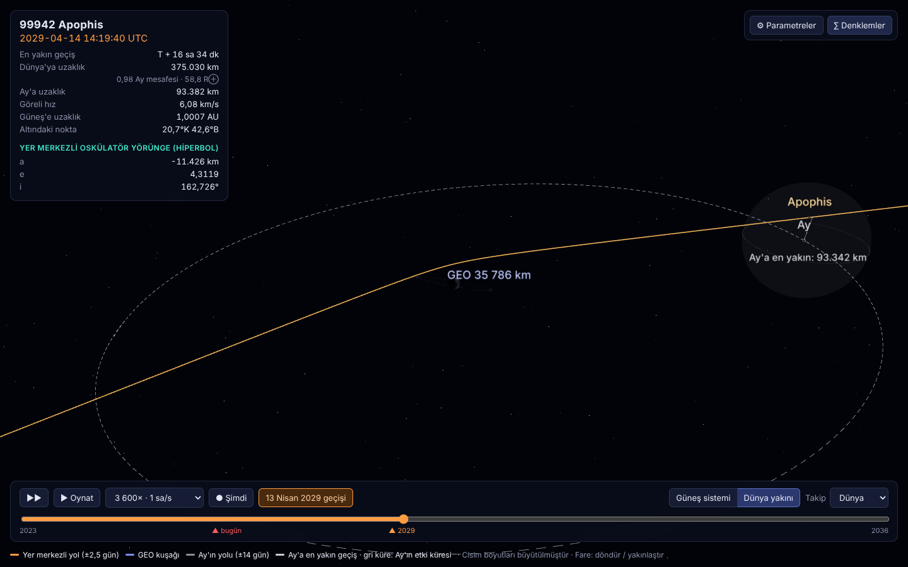

# r3f-apophis

<p align="center">
  <a href="https://claude.ai/artifact/9iNL3hgMrqnDQaqthZnd7m"></a>
</p>

<p align="center"><b>Demo:</b> <a href="https://claude.ai/artifact/9iNL3hgMrqnDQaqthZnd7m">https://claude.ai/artifact/9iNL3hgMrqnDQaqthZnd7m</a></p>

**99942 Apophis**'in 13 Nisan 2029'da Dünya'ya yakın geçişinin, yörünge mekaniği denklemleriyle hesaplanan, parametreleri değiştirilebilen gerçek zamanlı 3B simülasyonu (React Three Fiber).

## Demo

- **▶ [Demoyu aç (claude.ai)](https://claude.ai/artifact/9iNL3hgMrqnDQaqthZnd7m)** — derlenmiş uygulamanın tamamı, tarayıcıda kurulum gerektirmeden çalışır. Bağlantı sahibi paylaşana kadar özeldir (sayfadaki **Share** menüsünden herkese açılabilir).
- **GitHub Pages:** [billylz.github.io/r3f-apophis](https://billylz.github.io/r3f-apophis/) — depo herkese açık yapıldıktan ve Pages etkinleştirildikten sonra çalışır (bkz. [Demo yayını](#demo-yayını-github-pages)).

## Ekran görüntüleri

### 1 · Canlı mod: Güneş sistemi görünümü


Sayfa açıldığında görülen ekran. Simülasyon saati şu anki zamana kilitlidir (başlıkta kırmızı **● CANLI** rozeti).

- **Ortada** Güneş, çevresindeki ızgara ekliptik düzlemidir (1 halka = 0,25 AU).
- **Mavi elips** Dünya'nın yörüngesi.
- **Turuncu kesikli elips** Apophis'in 2029 öncesi yörüngesi: a ≈ 0,92 AU, Dünya yörüngesinin çoğunlukla içinde (Aten sınıfı).
- **Turkuaz kesikli elips** 2029 geçişinden sonraki yörüngesi: a ≈ 1,10 AU, artık büyük kısmı Dünya yörüngesinin dışında (Apollo sınıfı).
- **Açık sarı çizgi** Apophis'in son 300 günde izlediği yol.
- **Sol üst panel** anlık değerler: tarih ve saat, Dünya'ya uzaklık (AU, Ay mesafesi ve Dünya yarıçapı cinsinden), göreli hız, Güneş'e uzaklık ve o anki yörünge elemanları (a, e, i, periyot, sınıf).
- **Sağ panel** (⚙ Parametreler) senaryoyu değiştiren kaydırıcılar ve hazır senaryo düğmeleri; altta seçili senaryonun sonucu.
- **Alt çubuk** zaman kontrolü: ileri/geri, oynat/durdur, hız (1× gerçek zamandan 30 gün/s'ye), **● Şimdi**, 13 Nisan 2029'a atlama, görünüm seçimi ve kamera takibi. Zaman çubuğunda kırmızı ▲ bugünü, turuncu ▲ 2029 geçişini gösterir.

### 2 · Yakın geçiş: Dünya yakını görünümü


13 Nisan 2029, en yakın geçişten yaklaşık 43 dakika önce (T − 0 sa 43 dk).

- **Ortada** Dünya, gerçek boyutta ve gerçek saate göre dönerken; Güneş'in aydınlattığı taraf parlak, gece tarafı karanlık.
- **Mor halka** yer eşzamanlı (GEO) uyduların bulunduğu 35 786 km yükseklikteki kuşak.
- **Turuncu çizgi** Apophis'in Dünya'ya göre yolu (geçişin ±2,5 günü). Asteroit GEO kuşağının **içinden** geçer ve Dünya'nın çekimiyle yaklaşık 27° bükülür (hiperbolik yörünge).
- **Sol panel** bu anda: Dünya merkezine 41 796 km, göreli hız 7,34 km/s, asteroidin tam altındaki nokta (enlem/boylam). Dünya'ya yakın olduğu için yörünge elemanları yer merkezli hiperbol olarak verilir: e ≈ 4,32 (e > 1 → kapalı olmayan, tek geçişlik yörünge).
- **Sağ panel** (∑ Denklemler) kullanılan denklemleri seçili senaryonun sayılarıyla gösterir: Kepler denklemi, vis-viva, Güneş + Dünya çekimli hareket denklemi ve hiperbolik geçiş formülleri (e = 4,320, vₚ = 7,47 km/s, δ = 26,8°).

### 3 · "Ya çarparsa?" senaryosu


**Çarpma** hazır senaryosu: en yakın geçiş mesafesi 3 000 km'ye, yani Dünya yarıçapının (6 378 km) altına indirildi. Gerçekte böyle bir durum **beklenmiyor**; bu yalnızca modelin ne yaptığını gösteren bir "ya olsaydı" denemesidir.

- **Kırmızı çizgi** asteroidin yolu; Dünya yüzeyine değdiği anda biter.
- **Kırmızı "Çarpma" işareti** dönen Dünya üzerinde çarpma noktası.
- **Sol panel** çarpma yeri (1,2°K 0,5°B — Gine Körfezi), saati (21:38:12 UTC) ve çarpma hızı (12,64 km/s ≈ √(v∞² + 2μ⊕/R⊕)).
- **Sağ panel** kaydırıcının altında "Dünya yüzeyinin altında → çarpma" uyarısı; sonuç tablosunda geçiş sonrası yörünge yerine çarpma bilgisi.
- **Zaman çubuğu** çarpma anında biter (sağda "çarpma ▲").

### 4 · Ay'ın yanından geçiş



14 Nisan 2029, 14:19 UTC: Dünya'ya yakın geçişten 16,5 saat sonra Apophis bu kez Ay'ın yanından geçer. Kamera geri çekilerek Dünya–Ay sistemi bütün olarak gösterildi.

- **Ortada** Dünya ve çevresindeki GEO kuşağı (bu ölçekte küçük kalır).
- **Turuncu çizgi** Apophis'in yolu. Dünya'nın yakınında belirgin biçimde bükülür, sonra Ay'a doğru düz devam eder.
- **Kesikli beyaz elips** Ay'ın o tarihin ±14 günündeki yolu. Ay, Meeus'un Ay teorisiyle konumlanır.
- **Sağdaki gri küre** Ay'ın etki küresi (≈66 100 km). Bu kürenin içinde Ay'ın çekimi, Dünya'nınkine göre baskın hale gelir. Apophis kürenin içinden geçer.
- **"Ay'a en yakın: 93 342 km"** etiketi ve kesikli çizgi, en yakın an olan 14 Nisan 14:26 UTC'de Apophis'in ve Ay'ın konumlarını birleştirir.
- **Sol panel** Ay'a uzaklığı canlı gösterir (bu anda 93 382 km).

Ay'ın çekimi geçiş sonrası yörüngenin yarı büyük eksenini yaklaşık **−151 000 km** (≈0,001 AU) değiştirir. Bu değer ⚙ Parametreler panelinde "Ay'ın etkisi" satırında görünür; "Aysız" hazır senaryosuyla da karşılaştırılabilir.

## Özellikler

- **Canlı mod:** Açılışta simülasyon saati şu anki zamana (UTC) kilitlidir ve 1× gerçek zamanda akar. Apophis'in şu an nerede olduğunu, Dünya'ya uzaklığını ve hızını görürsün. **● Şimdi** düğmesi her zaman canlı moda döndürür.
- **Zaman hızı:** 1× (gerçek zaman), 60×, 600×, 3600×, 6 sa/s, 1 / 10 / 30 gün/s. İleri/geri akış, zaman çubuğunda "bugün" ve "2029" işaretleri.
- **İki 3B görünüm:**
  - *Güneş sistemi:* Dünya yörüngesi, Apophis'in izi, geçiş öncesi (turuncu) ve sonrası (turkuaz) yörüngeler.
  - *Dünya yakını:* Yer merkezli hiperbolik yol, GEO uydu kuşağı (35 786 km), GMST ile dönen ve Güneş'le aydınlanan Dünya, gerçek konumunda ve evresiyle Ay, Ay'ın etki küresi ve Ay'a en yakın geçiş işareti.
- **Kamera takibi:** Güneş / Dünya / Apophis / Ay'a kilitlenir. Fareyle döndür ve yakınlaştır.
- **Değiştirilebilir parametreler** (⚙ Parametreler): her değişiklikte yörünge anında yeniden entegre edilir.

  | Parametre | Aralık | Etkisi |
  |---|---|---|
  | En yakın geçiş mesafesi rₚ | 1 000 – 1 000 000 km | R⊕'nin altına inerse çarpma: yer, saat ve çarpma hızı hesaplanır |
  | Sonsuzdaki hız v∞ | 0,5 – 30 km/s | Yaklaşma hızı; güneş merkezli yörüngeyi de değiştirir |
  | Çarpma parametresi açısı | 0 – 360° | Dünya'nın hangi tarafından geçtiği: önden geçerse enerji kaybeder, arkadan geçerse kazanır |
  | Dünya kütlesi çarpanı | 0 – 10× | 0 = çekimsiz Dünya |
  | Ay kütlesi çarpanı | 0 – 20× | 0 = Ay çekimi yok. Ay'ın etkisi sonuç tablosunda ayrıca hesaplanır |

  Hazır senaryolar: *JPL tahmini, Ay mesafesi, GEO sınırı, Sıyırma, Çarpma, Aysız, Çekimsiz Dünya.*
- **Canlı göstergeler:** Dünya'ya ve Ay'a uzaklık, göreli hız, altındaki coğrafi nokta, oskülatör yörünge elemanları (Dünya'nın Hill küresi içinde yer merkezli hiperbol, dışında güneş merkezli) ve yörünge sınıfı (Aten / Apollo / Amor / Atira).
- **∑ Denklemler:** Kepler, vis-viva, N-cisim ve hiperbolik geçiş denklemleri, seçili parametrelerin sayısal değerleriyle (KaTeX).

## Çalıştırma

```bash
npm install
npm run dev      # geliştirme sunucusu
npm test         # fizik kontrolleri (Node ≥ 22)
npm run build    # dist/
```

## Model

| Bileşen | Yöntem |
|---|---|
| Dünya | Dünya–Ay ağırlık merkezi için Kepler yörüngesi (JPL Standish J2000 elemanları), Dünya merkezi buradan `r⊕ = r_EMB − r☾⊕/82,3` ile bulunur (`src/physics/ephemeris.ts`) |
| Ay | Meeus, *Astronomical Algorithms* Bölüm 47: ELP-2000/82'nin ana terimleri, ~10″ doğruluk (`src/physics/moon.ts`) |
| Kepler denklemi | `M = E − e sin E`, Newton–Raphson (`src/physics/kepler.ts`) |
| Apophis | Güneş + Dünya + Ay çekimi: `r̈ = −μ☉ r/|r|³ − Σₖ μₖ [(r−rₖ)/|r−rₖ|³ + rₖ/|rₖ|³]`, k ∈ {⊕, ☾}. Dormand–Prince RK5(4), Dünya'ya ve Ay'a yaklaştıkça küçülen adım (`src/physics/integrator.ts`) |
| Yakın geçiş | Yerberide hiperbolik geçişten başlangıç durumu: `e = 1 + rₚv∞²/μ⊕`, `sin(δ/2) = 1/e` (`src/physics/apophis.ts`) |
| Dünya dönüşü | GMST ve ekliptik eğikliği ε (`src/physics/earthRotation.ts`) |

Başlangıç durumu yakın geçiş anında (2029-04-13 21:46 UTC) kurulur, oradan geriye ve ileriye entegre edilir. Yerberi Dünya'nın içindeyse, yörüngenin yüzeye ilk değdiği an ikiye bölme yöntemiyle bulunur.

`npm test` sonuçları (varsayılan JPL senaryosu):

| | a [AU] | e | i | Sınıf |
|---|---|---|---|---|
| Geçiş öncesi | 0,9226 | 0,193 | 3,34° | Aten |
| Geçiş sonrası | 1,1021 | 0,191 | 2,21° | Apollo |

- Dünya'ya en yakın mesafe 38 012 km, v∞ = 5,90 km/s. Asteroidin altındaki nokta Atlantik üzerinde (≈29°K, 44°B).
- Ay'a en yakın mesafe 93 342 km, 14 Nisan 2029 14:26 UTC. Ay'ın geçiş sonrası a'ya etkisi ≈ −151 000 km.
- Testler ayrıca şunları doğrular:
  - Ay efemerisi Meeus'un örnek 47.a'sıyla uyumludur.
  - Dünya ve Ay çekimi kapalıyken yörünge değişmez.
  - Çarpma senaryosunda çarpma hızı √(v∞² + 2μ⊕/R⊕) olur.

**Sınırlamalar:**
- Bu bir eğitim modelidir. Diğer gezegenler, Dünya'nın basıklığı (J2), Yarkovsky etkisi, nütasyon ve UTC/TDB farkı yok sayılmıştır.
- Apophis'in elemanları JPL'den yaklaşık alınmıştır. Çarpma parametresi açısı, geçiş sonrası elemanlar JPL tahminine uyacak şekilde ayarlanmıştır.
- Güneş sistemi görünümünde cisim boyutları büyütülmüştür (Dünya yakını görünümünde Dünya ve Ay gerçek ölçektedir).

## Demo yayını (GitHub Pages)

`.github/workflows/pages.yml` her push'ta testleri çalıştırır ve projeyi derler. Varsayılan dala yapılan push'larda `dist/` klasörünü GitHub Pages'e yayınlar.

Pages'in çalışması için:

1. **Depo herkese açık olmalı** (Settings → General → Danger Zone → Change visibility → Public). Ücretsiz GitHub hesaplarında Pages gizli depolarda çalışmaz; gizli depo için GitHub Pro gerekir.
2. **Settings → Pages → Build and deployment → Source: GitHub Actions** seçilmeli.
3. Actions sekmesinde son çalıştırmada **Re-run jobs**.

Dünya dokusu: NASA Blue Marble (kamu malı).
