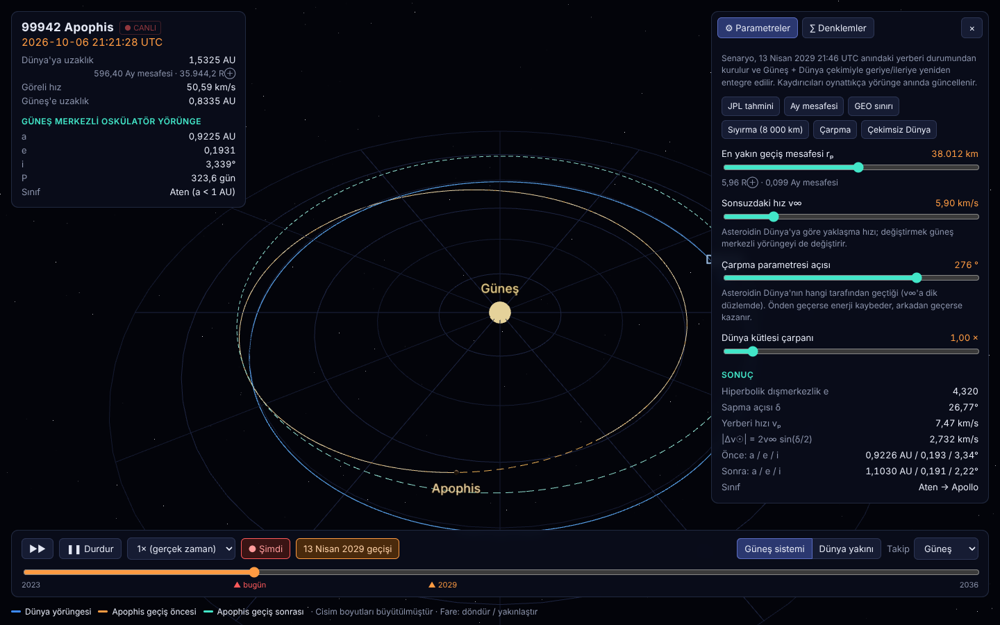
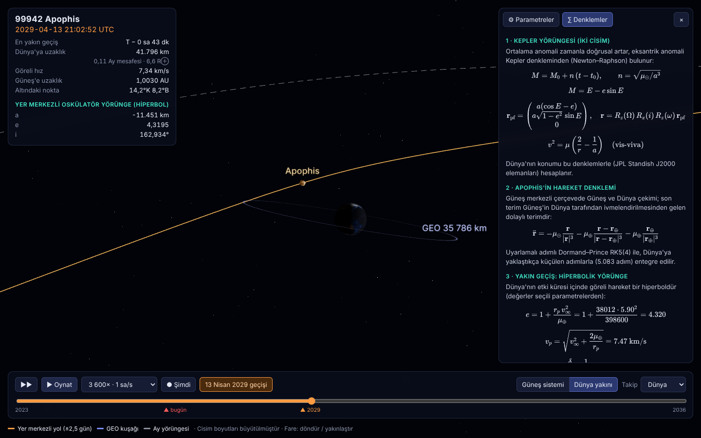
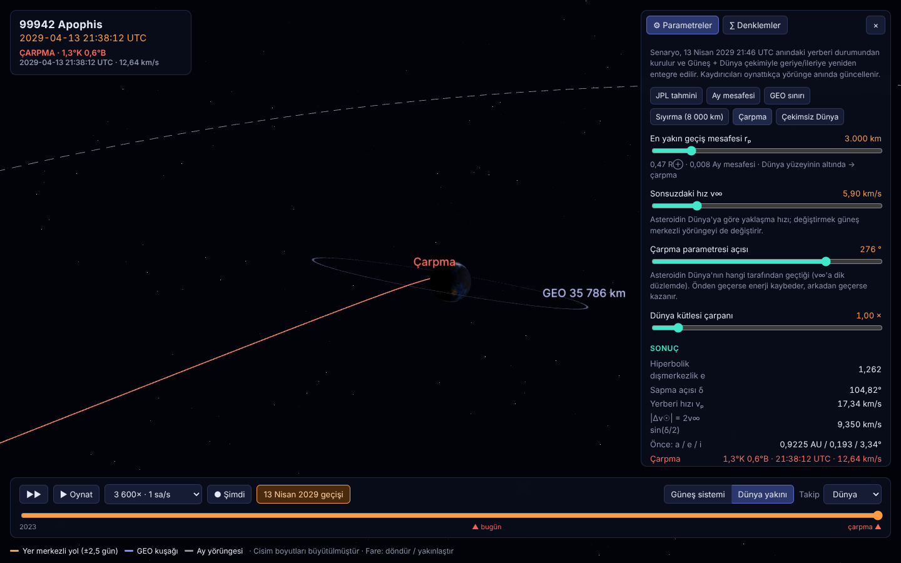

# r3f-apophis

**99942 Apophis**'in 13 Nisan 2029'da Dünya'ya yakın geçişinin, yörünge mekaniği denklemleriyle hesaplanan, parametreleri değiştirilebilen gerçek zamanlı 3B simülasyonu (React Three Fiber).

### ▶ [Canlı demo: billylz.github.io/r3f-apophis](https://billylz.github.io/r3f-apophis/)



| Yakın geçiş (GEO kuşağının içinden) | "Ya çarparsa?" senaryosu |
|---|---|
|  |  |

## Özellikler

- **Canlı mod:** Açılışta simülasyon saati şu anki zamana (UTC) kilitlidir ve 1× gerçek zamanda akar. Apophis'in şu an nerede olduğunu, Dünya'ya uzaklığını ve hızını görürsün. **● Şimdi** düğmesi her zaman canlı moda döndürür.
- **Zaman hızı:** 1× (gerçek zaman), 60×, 600×, 3600×, 6 sa/s, 1 / 10 / 30 gün/s. İleri/geri akış, zaman çubuğunda "bugün" ve "2029" işaretleri.
- **İki 3B görünüm:**
  - *Güneş sistemi:* Dünya yörüngesi, Apophis'in izi, geçiş öncesi (turuncu) ve sonrası (turkuaz) yörüngeler.
  - *Dünya yakını:* Yer merkezli hiperbolik yol, GEO uydu kuşağı (35 786 km), GMST ile dönen ve Güneş'le aydınlanan Dünya, Ay.
- **Kamera takibi:** Güneş / Dünya / Apophis'e kilitlenir. Fareyle döndür ve yakınlaştır.
- **Değiştirilebilir parametreler** (⚙ Parametreler): her değişiklikte yörünge anında yeniden entegre edilir.

  | Parametre | Aralık | Etkisi |
  |---|---|---|
  | En yakın geçiş mesafesi rₚ | 1 000 – 1 000 000 km | R⊕'nin altına inerse çarpma: yer, saat ve çarpma hızı hesaplanır |
  | Sonsuzdaki hız v∞ | 0,5 – 30 km/s | Yaklaşma hızı; güneş merkezli yörüngeyi de değiştirir |
  | Çarpma parametresi açısı | 0 – 360° | Dünya'nın hangi tarafından geçtiği: önden geçerse enerji kaybeder, arkadan geçerse kazanır |
  | Dünya kütlesi çarpanı | 0 – 10× | 0 = çekimsiz Dünya, yörünge hiç değişmez |

  Hazır senaryolar: *JPL tahmini, Ay mesafesi, GEO sınırı, Sıyırma, Çarpma, Çekimsiz Dünya.*
- **Canlı göstergeler:** Uzaklık (km, Ay mesafesi, R⊕), göreli hız, altındaki coğrafi nokta, oskülatör yörünge elemanları (Dünya'nın Hill küresi içinde yer merkezli hiperbol, dışında güneş merkezli) ve yörünge sınıfı (Aten / Apollo / Amor / Atira).
- **∑ Denklemler:** Kepler, vis-viva, N-cisim ve hiperbolik geçiş denklemleri, seçili parametrelerin sayısal değerleriyle (KaTeX).

## Çalıştırma

```bash
npm install
npm run dev      # geliştirme sunucusu
npm test         # fizik kontrolleri (Node ≥ 22)
npm run build    # dist/
```

## Model

| Bileşen | Yöntem |
|---|---|
| Dünya | Kepler yörüngesi, JPL Standish J2000 ortalama elemanları (`src/physics/ephemeris.ts`) |
| Kepler denklemi | `M = E − e sin E`, Newton–Raphson (`src/physics/kepler.ts`) |
| Apophis | `r̈ = −μ☉ r/|r|³ − μ⊕ (r−r⊕)/|r−r⊕|³ − μ⊕ r⊕/|r⊕|³`, Dormand–Prince RK5(4) uyarlamalı adım (`src/physics/integrator.ts`) |
| Yakın geçiş | Yerberide hiperbolik geçişten başlangıç durumu: `e = 1 + rₚv∞²/μ⊕`, `sin(δ/2) = 1/e` (`src/physics/apophis.ts`) |
| Dünya dönüşü | GMST ve ekliptik eğikliği ε (`src/physics/earthRotation.ts`) |

Başlangıç durumu yakın geçiş anında (2029-04-13 21:46 UTC) kurulur, oradan geriye ve ileriye entegre edilir. Yerberi Dünya'nın içindeyse, yörüngenin yüzeye ilk değdiği an ikiye bölme yöntemiyle bulunur.

`npm test` sonuçları (varsayılan JPL senaryosu):

| | a [AU] | e | i | Sınıf |
|---|---|---|---|---|
| Geçiş öncesi | 0,9226 | 0,193 | 3,34° | Aten |
| Geçiş sonrası | 1,1030 | 0,191 | 2,22° | Apollo |

- En yakın mesafe 38 012 km, v∞ = 5,90 km/s. Asteroidin altındaki nokta Atlantik üzerinde (≈29°K, 44°B).
- Testler ayrıca çekimsiz Dünya'da yörüngenin değişmediğini ve çarpma senaryosunda çarpma hızının √(v∞² + 2μ⊕/R⊕) olduğunu doğrular.

**Sınırlamalar:**
- Bu bir eğitim modelidir. Diğer gezegenler, Ay'ın çekimi, Yarkovsky etkisi ve UTC/TDB farkı yok sayılmıştır.
- Apophis'in elemanları JPL'den yaklaşık alınmıştır. Çarpma parametresi açısı, geçiş sonrası elemanlar JPL tahminine uyacak şekilde ayarlanmıştır.
- Ay'ın konumu yalnızca görseldir. Cisim boyutları büyütülmüştür.

## Demo yayını (GitHub Pages)

`.github/workflows/pages.yml` her push'ta testleri çalıştırır ve projeyi derler. Varsayılan dala yapılan push'larda `dist/` klasörünü GitHub Pages'e yayınlar.

İlk kurulumda bir kez **Settings → Pages → Build and deployment → Source: GitHub Actions** seçilmelidir.

Dünya dokusu: NASA Blue Marble (kamu malı).
